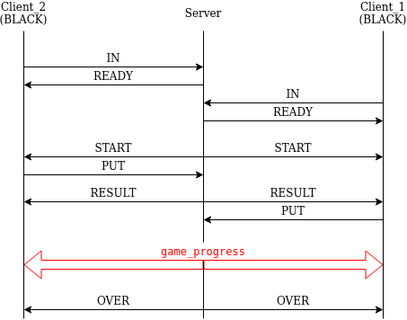

# connectsix-protocol
Communication protocol for connect6 game based on tcp

## Prerequisite

- 돌을 놓을 수 있는 칸은 가로 세로 각 19개의 칸을 가진 정방형이다
- 좌측 상단을 기준으로 하며, 가로 세로 각 0~18의 숫자로 좌표를 표현한다
- 돌을 둘 수 있는 시간 즉, 제한시간은 한 차례에 30초로 하며, 30초 이내에는 올바르지 못한 곳에 돌을 두는 시도가 있더라도 오류 메시지로 알림으로써 클라이언트가 다시 돌을 둘 수 있도록 한다
- 돌을 6개 연이어 두는 쪽이 승리하며, 30초 이내에 돌을 두지 않거나 못 하였을 때에는 패배로 한다
- 바둑판의 남은 자리에 어느 한 쪽의 돌로 매꾸었음에도 불구하고 승리하지 못 하는 경우에는 무승부로 한다

## Protocol

### Server-Client Model

- 7기 오델로 프로토콜에서 이용하였던 Server-Client Model을 채택하여 사용한다
- 채택 이유는 [othello-server repository](https://github.com/umbum/othello-server)를 참고

#### Server to Client

- [READY](#READY)
- [START](#START)
- [TURN](#TURN)
- [RESULT](#RESULT)
- [OVER](#OVER)
- [ERROR](#ERROR)

#### Client to Server

- [IN](#IN)
- [PUT](#PUT)

### Packets

- 모든 패킷은 1바이트의 플래그와 그 플래그에 맞는 데이터로 구성되어 있다

| flag | data |
| ---- | ---- |
| 1byte | nbit |

- flag의 각 비트는 아래와 같은 의미를 가진다

| 0 | 1 | 2 | 3 | 4 | 5 | 6 | 7 |
| - | - | - | - | - | - | - | - |
| [IN](#IN) | [READY](#READY) | [START](#START) | [PUT](#PUT) | [RESULT](#RESULT) | [OVER](#OVER) | [RESERVED](#RESURVED) | [ERROR](#ERROR) |

#### IN

게임 참가 의사를 표현

- 구성

| flag |
| ---- |
| 1byte |

- 예시
	- 게임에 참가를 요구하는 경우
		| 1 | 0 | 0 | 0 | 0 | 0 | 0 | 0 |
		| - | - | - | - | - | - | - | - |
	- elements
		- flag (IN)
			| 1 | 0 | 0 | 0 | 0 | 0 | 0 | 0 |
			| - | - | - | - | - | - | - | - |

#### READY

게임 참가가 완료되었음을 전달

- 구성

| flag |
| ---- |
| 1byte |

- 예시
	- 게임 참가 요청이 들어왔으며, 이를 확인한 경우
		| 0 | 1 | 0 | 0 | 0 | 0 | 0 | 0 |
		| - | - | - | - | - | - | - | - |
	- elements
		- flag (READY)
			| 0 | 1 | 0 | 0 | 0 | 0 | 0 | 0 |
			| - | - | - | - | - | - | - | - |

#### START

게임 시작 안내

- 구성

| flag | color |
| ---- | ----- |
| 1byte | 1bit |

- 예시
	- 흑돌로 게임을 시작하는 경우
		| 0 | 0 | 1 | 0 | 0 | 0 | 0 | 0 | 1 |
		| - | - | - | - | - | - | - | - | - |
	- elements
		- flag (START)
			| 0 | 0 | 1 | 0 | 0 | 0 | 0 | 0 |
			| - | - | - | - | - | - | - | - |
		- color (BLACK)
			| 1 |
			| - |

#### PUT

바둑돌을 둘 위치 전송

- 구성

| flag | color | vertical | horizontal |
| ---- | ----- | -------- | ---------- |
| 1byte | 1bit | 1byte | 1byte |

- 예시
	- 흑돌을 C2(2,1) 에 두는 경우
		| 0 | 0 | 0 | 1 | 0 | 0 | 0 | 0 | 1 | 0 | 0 | 0 | 0 | 0 | 0 | 1 | 0 | 0 | 0 | 0 | 0 | 0 | 0 | 0 | 1 |
		| - | - | - | - | - | - | - | - | - | - | - | - | - | - | - | - | - | - | - | - | - | - | - | - | - |
	- elements
		- flag (PUT)
			| 0 | 0 | 0 | 1 | 0 | 0 | 0 | 0 |
			| - | - | - | - | - | - | - | - |
		- color (BLACK)
			| 1 |
			| - |
		- vertical (2)
			| 0 | 0 | 0 | 0 | 0 | 0 | 1 | 0 |
			| - | - | - | - | - | - | - | - |
		- horizontal (1)
			| 0 | 0 | 0 | 0 | 0 | 0 | 0 | 1 |
			| - | - | - | - | - | - | - | - |

#### RESULT

바둑돌을 둔 이후 결과를 안내

- 구성

| flag | privcolor | vertical | horizontal | nextcolor |
| ---- | --------- | -------- | ---------- | --------- |
| 1byte | 1bit | 1byte | 1byte | 1bit |

- 예시
	- 이전에 흑돌이 C2(2,1) 에 두었고, 다음은 흰돌의 차례인 경우
		| 0 | 0 | 0 | 0 | 1 | 0 | 0 | 0 | 1 | 0 | 0 | 0 | 0 | 0 | 0 | 1 | 0 | 0 | 0 | 0 | 0 | 0 | 0 | 0 | 1 | 0 |
		| - | - | - | - | - | - | - | - | - | - | - | - | - | - | - | - | - | - | - | - | - | - | - | - | - | - |
	- elements
		- flag (RESULT)
			| 0 | 0 | 0 | 0 | 1 | 0 | 0 | 0 |
			| - | - | - | - | - | - | - | - |
		- privcolor (BLACK)
			| 1 |
			| - |
		- vertical (2)
			| 0 | 0 | 0 | 0 | 0 | 0 | 1 | 0 |
			| - | - | - | - | - | - | - | - |
		- horizontal (1)
			| 0 | 0 | 0 | 0 | 0 | 0 | 0 | 1 |
			| - | - | - | - | - | - | - | - |
		- nextcolor (WHITE)
			| 0 |
			| - |

#### OVER

게임의 승패가 결정된 후 결과 안내

- 구성

| flag | timeout | draw | winner |
| ---- | ------- | ---- | ------ |
| 1byte | 1bit | 1bit | 1bit |

- 예시
	- 무승부인 경우
		| 0 | 0 | 0 | 0 | 0 | 1 | 0 | 0 | 0 | 1 | 0 |
		| - | - | - | - | - | - | - | - | - | - | - |
	- elements
		- flag (OVER)
			| 0 | 0 | 0 | 0 | 0 | 1 | 0 | 0 |
			| - | - | - | - | - | - | - | - |
		- timeout (FALSE)
			| 0 |
			| - |
		- draw (TRUE)
			| 1 |
			| - |
		- winner (WHITE, ignored)
			| 0 |
			| - |

#### ERROR

에러가 발생하였음을 전달

- 구성

| flag | code |
| ---- | ---- |
| 1byte | 1byte |

- 예시
	- 에러코드 33인 에러가 발생한 경우
		| 0 | 0 | 0 | 0 | 0 | 0 | 0 | 1 | 0 | 0 | 1 | 0 | 0 | 0 | 0 | 1 |
		| - | - | - | - | - | - | - | - | - | - | - | - | - | - | - | - |
	- elements
		- flag (ERROR)
			| 0 | 0 | 0 | 0 | 0 | 0 | 0 | 1 |
			| - | - | - | - | - | - | - | - |
		- code (33)
			| 0 | 0 | 1 | 0 | 0 | 0 | 0 | 1 |
			| - | - | - | - | - | - | - | - |
